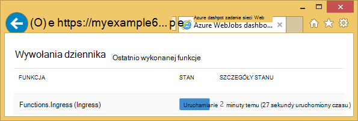
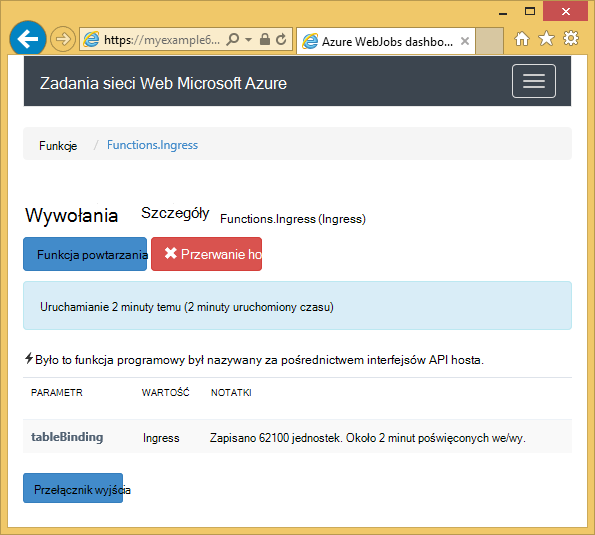
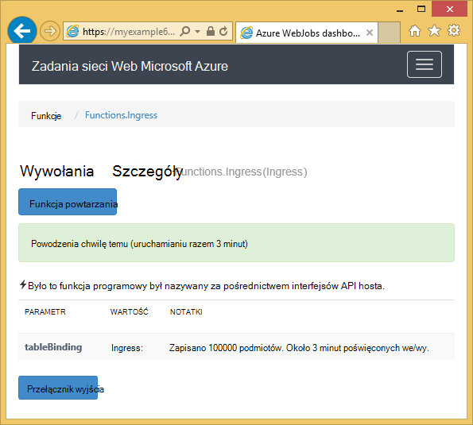

<properties
    pageTitle="Wprowadzenie do programu Visual Studio i magazynowania Azure połączenia usług (WebJob projektów)"
    description="Jak rozpocząć pracę z magazynem tabel platformy Azure w projekcie Azure WebJobs w programie Visual Studio po nawiązywanie połączenia z kontem miejsca do magazynowania przy użyciu programu Visual Studio połączenia usług"
    services="storage"
    documentationCenter=""
    authors="TomArcher"
    manager="douge"
    editor=""/>

<tags
    ms.service="storage"
    ms.workload="web"
    ms.tgt_pltfrm="vs-getting-started"
    ms.devlang="na"
    ms.topic="article"
    ms.date="07/18/2016"
    ms.author="tarcher"/>

# Wprowadzenie do programu Azure przestrzeni dyskowej (Azure WebJob projektów)

[AZURE.INCLUDE [storage-try-azure-tools-tables](../../includes/storage-try-azure-tools-tables.md)]

## Omówienie

Ten artykuł zawiera C# przykłady pokazujące pokazująca, jak korzystać z wersji Azure WebJobs SDK 1.x z usługą Magazyn tabel platformy Azure. Przykłady kodu przy użyciu wersji [WebJobs SDK](../app-service-web/websites-dotnet-webjobs-sdk.md) 1.x.

Usługa magazynu tabel platformy Azure umożliwia przechowywanie dużych ilości danych strukturalnych. Usługa jest NoSQL magazynu danych, która akceptuje uwierzytelnionych połączeń z wewnątrz i na zewnątrz Azure chmury. Tabele Azure to idealne rozwiązanie w przypadku przechowywania danych strukturalnych, -relacyjnych.  Aby uzyskać więcej informacji, zobacz [Rozpoczynanie pracy z magazynem tabel platformy Azure za pomocą .NET](storage-dotnet-how-to-use-tables.md#create-a-table) .

Niektóre fragmenty kodu widoczne atrybut **tabeli** używane w funkcjach, które są nazywane ręcznie, oznacza to, że nie przy użyciu jednego z atrybutów wyzwalacza.

## Dodawanie obiektów do tabeli

Aby dodać obiektów do tabeli, użyj atrybut **tabeli** z **ICollector<T> ** lub **IAsyncCollector<T> ** parametru w przypadku gdy **T** Określa schemat jednostki, w której chcesz dodać. Konstruktor atrybutu ma parametr ciąg określający nazwę tabeli.

Poniższy przykładowy kod dodaje **osoby** obiektów do tabeli o nazwie *Ingress*.

        [NoAutomaticTrigger]
        public static void IngressDemo(
            [Table("Ingress")] ICollector<Person> tableBinding)
        {
            for (int i = 0; i < 100000; i++)
            {
                tableBinding.Add(
                    new Person() {
                        PartitionKey = "Test",
                        RowKey = i.ToString(),
                        Name = "Name" }
                    );
            }
        }

Zazwyczaj typ, którego używasz z **ICollector** pochodzi z **TableEntity** lub wykonuje **ITableEntity**, ale nie musi być. Jedną z następujących klas **osoba** Praca z kodu pokazano w powyższej metody **Ingress** .

        public class Person : TableEntity
        {
            public string Name { get; set; }
        }

        public class Person
        {
            public string PartitionKey { get; set; }
            public string RowKey { get; set; }
            public string Name { get; set; }
        }

Jeśli chcesz pracować bezpośrednio z magazynu Azure interfejsu API, możesz dodać parametr **CloudStorageAccount** w podpisie metody.

## Monitorowania w czasie rzeczywistym

Ponieważ funkcje ingress danych często procesu dużych ilości danych, na pulpicie nawigacyjnym WebJobs SDK zawiera dane czasu rzeczywistego monitorowania. Sekcji **Dziennik wywołania** informuje, czy funkcja jest nadal uruchomiony.

Na stronie **Szczegółów wywołania** raportów funkcji postępu (liczba jednostek napisane) jest uruchomiony, i daje możliwość przerwać go.

Po zakończeniu działania funkcji na stronie **Szczegółów wywołania** raportów liczba wierszy zapisywanych.

## Jak odczytać wiele jednostek z tabeli

Aby odczytać tabeli, użyj atrybut **tabeli** z **IQueryable<T> ** parametr, którym typu **T** pochodzi z **TableEntity** lub wykonuje **ITableEntity**.

Poniższy przykład kodu odczytuje i loguje się wszystkie wiersze z tabeli **Ingress** :

        public static void ReadTable(
            [Table("Ingress")] IQueryable<Person> tableBinding,
            TextWriter logger)
        {
            var query = from p in tableBinding select p;
            foreach (Person person in query)
            {
                logger.WriteLine("PK:{0}, RK:{1}, Name:{2}",
                    person.PartitionKey, person.RowKey, person.Name);
            }
        }

### Jak odczytać całość z tabeli

Ma konstruktora atrybut **tabeli** z dwoma dodatkowe parametry, które umożliwiają określenie klucz partycją i klucz wiersza, gdy chcesz powiązać podmiot jednej tabeli.

Poniższy przykład kodu otrzymuje wiersz tabeli dla jednostki **osoby** , na podstawie partition klucz i wiersz klucza wartości otrzymanych w kolejce wiadomości:  

        public static void ReadTableEntity(
            [QueueTrigger("inputqueue")] Person personInQueue,
            [Table("persontable","{PartitionKey}", "{RowKey}")] Person personInTable,
            TextWriter logger)
        {
            if (personInTable == null)
            {
                logger.WriteLine("Person not found: PK:{0}, RK:{1}",
                        personInQueue.PartitionKey, personInQueue.RowKey);
            }
            else
            {
                logger.WriteLine("Person found: PK:{0}, RK:{1}, Name:{2}",
                        personInTable.PartitionKey, personInTable.RowKey, personInTable.Name);
            }
        }

Nie ma klasy **osoby** w tym przykładzie do wykonania **ITableEntity**.

## Jak korzystać z interfejsu API magazynu .NET bezpośrednio do pracy z tabeli

Atrybut **tabeli** można również używać z obiektu **CloudTable** dla większa elastyczność podczas pracy z tabelą.

W poniższym przykładzie kodu użyto obiektu **CloudTable** dodać jedną osobę do tabeli *Ingress* .

        public static void UseStorageAPI(
            [Table("Ingress")] CloudTable tableBinding,
            TextWriter logger)
        {
            var person = new Person()
                {
                    PartitionKey = "Test",
                    RowKey = "100",
                    Name = "Name"
                };
            TableOperation insertOperation = TableOperation.Insert(person);
            tableBinding.Execute(insertOperation);
        }

Aby uzyskać więcej informacji o używaniu obiektu **CloudTable** zobacz [Rozpoczynanie pracy z magazynem tabel platformy Azure za pomocą .NET](storage-dotnet-how-to-use-tables.md).

## Tematy pokrewne objętych artykule kolejki

Aby uzyskać informacje o obsługę przetwarzania tabeli wyzwalane przez wiadomości kolejki lub scenariuszy WebJobs SDK nie określonych tabeli przetwarzanie, zobacz temat [Wprowadzenie do programu Visual Studio i magazynowania kolejki Azure usługi połączone (WebJob projektów)](vs-storage-webjobs-getting-started-queues.md).

## Następne kroki

W tym artykule udostępniła przykłady kodu, pokazujące sposób obsługi typowe scenariusze dotyczące pracy z tabelami Azure. Aby uzyskać więcej informacji o używaniu Azure WebJobs i WebJobs SDK, zobacz [zasoby dokumentacji Azure WebJobs](http://go.microsoft.com/fwlink/?linkid=390226).
