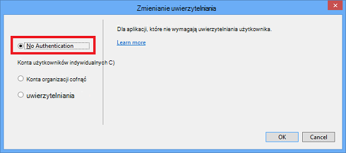

<properties
    pageTitle="Tworzenie obrazy w promocji cenowych"
    description="Wyjaśniono, jak tworzyć obrazy w promocji cenowych zgodnie z zaleceniami dotyczącymi ustawieniem repozytoria Azure."
    services=""
    solutions=""
    documentationCenter=""
    authors="kenhoff"
    manager="ilanas"
    editor="tysonn"/>

<tags
    ms.service="contributor-guide"
    ms.devlang=""
    ms.topic="article"
    ms.tgt_pltfrm=""
    ms.workload=""
    ms.date="06/25/2015"
    ms.author="kenhoff" />

# <a name="create-images-in-markdown"></a>Tworzenie obrazów w promocji cenowych

## <a name="image-folder-creation-and-link-syntax"></a>Obraz folderu tworzenia i łącza składni

Dla nowego artykułu musisz utworzyć folder w następującej lokalizacji:

    /articles/<service-directory>/media/<article-name>/

Na przykład:

    /articles/app-service/media/app-service-enterprise-multichannel-apps/

Po utworzeniu folderu i obrazy do niego, można tworzyć obrazy w artykule należy użyć następującej składni:

```

```
Przykład:

Zobacz temat [szablonów promocji cenowych](../markdown%20templates/markdown-template-for-new-articles.md) , na przykład.  Obraz odnośniki w tym szablonie promocji cenowych mają być w dolnej części szablonu.

## <a name="guidelines-specific-to-azuremicrosoftcom"></a>Wskazówki dotyczące azure.microsoft.com

Zrzuty ekranu obecnie jest zalecane, jeśli nie jest możliwe włączenie Odtwórz czynności. Napisz zawartości, tak aby zawartość można pozostawić bez zrzutów ekranu w razie potrzeby.

Za pomocą tych wskazówek podczas tworzenia i dołączanie plików clipart:
- Nie udostępniaj pliki ClipArt w dokumentach. Skopiuj plik wymagane i dodać je do folderu multimediów do określonego tematu. Współużytkowanie plików jest zalecane, ponieważ jest łatwiej można Usuń przestarzałe zawartości i obrazów, które zachowuje repo Oczyść.

- Formaty plików: Korzystanie z plików PNG — są wyższą jakość i zachować ich jakości podczas procesu lokalizacji. Inne formaty plików nie obsługują także ich jakości. Format JPEG jest dozwolone, ale nie preferowany.  Nie animowanych plików GIF.

- Używanie czerwone kwadraty domyślnej szerokości opisane w programie Paint (5 pikseli) aby zwrócić uwagę na poszczególne elementy zrzuty ekranu.  

    Przykład:

    

- Gdy jest to właściwe rozwiązanie, zachęcamy do przycinania obrazów, więc elementy interfejsu użytkownika będzie wyświetlany w pełnym rozmiarze. Upewnij się, że kontekst jest wyczyszczone dla użytkowników, ale.

- Unikaj białe znaki na krawędziach zrzutów ekranu. Jeśli przyciąć zrzut ekranu w taki sposób, aby liście białe tło na krawędziach, należy dodać piksela Szare obramowanie obrazu.  Jeśli Paint, przy użyciu jaśniejszy kolor szary w domyślnej palety kolorów (0xC3C3C3). Jeśli przy użyciu grafiki aplikacji, koloru RGB jest R195, G195, 195. Można łatwo dodawać Szare obramowanie wokół obrazu w programie Visio — Aby to zrobić, zaznacz obraz, zaznacz wiersz i upewnij się, poprawić kolor jest ustawiona, a następnie zmień grubość linii na punktów 1 1/2.  Zrzuty ekranu powinien mieć Szare obramowanie 1 piksel na poziomie, dlatego białych obszarach zrzut ekranu nie Rozmycie na stronę sieci web.

    Przykład:

    
    
    Narzędzia ułatwiające zautomatyzować proces dodawania obramowania wymagane do obrazów zobacz [Narzędzia AddACOMBorder - jak zautomatyzować proces dodawania obramowania wymagane 1 piksel szarym ACOM obrazów](https://github.com/Azure/Azure-CSI-Content-Tools/tree/master/Tools/AddACOMImageBorder).

- Obrazy koncepcyjne z odstępy nie ma potrzeby Szare obramowanie.  

    Przykład:

    

- Nie należy wprowadzić obrazu jest zbyt długa.  Obrazy zostanie automatycznie dopasowane, jeśli ta osoba jest zbyt długa. Jednak czasami rozmiaru powoduje, że rozmycia, dlatego jest zalecane, można ograniczyć szerokość obrazów do 780 pikseli i ręcznie zmiany rozmiaru obrazów przed przesłaniem w razie potrzeby.

- Pokazywanie wyjściowe polecenia w zrzutów ekranu.  Jeśli artykuł zawiera instrukcje miejsce, w którym użytkownik pracuje w obrębie powłokę, jest przydatne wyświetlić dane wyjściowe polecenia w zrzutów ekranu. W tym przypadku ogólnie ograniczanie jej szerokość powłoki do około 72 znaków gwarantuje, że obraz pozostanie w wytycznymi szerokość 780 pikseli. Przed podjęciem zrzut ekranu przedstawiający wynik, Zmień rozmiar okna tak, aby tylko odpowiednie polecenie i wynik jest (opcjonalnie z pusty wiersz po obu stronach).

- Skorzystaj z całego zrzutów ekranu systemu windows, jeśli to możliwe. Podejmując zrzut ekranu przedstawiający okno przeglądarki, Zmień rozmiar okna przeglądarki do 780 pikseli szerokości lub mniej i Zachowaj wysokości okna przeglądarki jako krótkie możliwie takie, które aplikacji zmieszczą się w oknie.

    Przykład:

    

- Należy zachować ostrożność przy użyciu tego, jakie informacje są czytelne zrzuty ekranu.  Nie ujawniać informacji o firmie wewnętrzny lub informacje osobiste.

- Grafika koncepcyjna lub diagramów przy użyciu ikon oficjalnym w chmurze i Enterprise symbol i zestawu ikon. Konfigurowanie publicznej jest dostępna w http://aka.ms/CnESymbols.

- Zamień tekst zastępczy ujęte w nawiasy informacji osobistych i prywatnych zrzuty ekranu. Ta opcja uwzględnia nazw użytkowników, identyfikatory subskrypcji i inne informacje pokrewne. Można zastąpić nazwiskami [zatwierdzony fikcyjnych nazwę](https://aka.ms/ficticiousnames)(łącze tylko do pracowników). Nie należy używać Porada Conte lub znacznik w programie Paint zasłaniały lub Rozmycie informacji osobistych i prywatne.

  Poniższy obraz został poprawnie zaktualizowany Aby zamienić symbol zastępczy informacji rzeczywisty **identyfikator subskrypcji** :

  

### <a name="contributors-guide-links"></a>Współautorzy przewodnik łącza

- [Artykuł Omówienie](./../README.md)
- [Indeks artykułów ze wskazówkami dotyczącymi](./contributor-guide-index.md)
