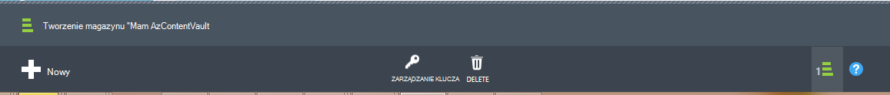

## Tworzenie kopii zapasowej magazynu
Do tworzenia kopii zapasowych plików i danych z systemem Windows Server lub dane Protection Manager (DPM) Azure lub podczas wykonywania kopii zapasowej IaaS maszyny wirtualne Azure, możesz utworzyć kopii zapasowej magazynu w danym regionie geograficznym miejsce, w którym mają być przechowywane dane.

Poniższe kroki przeprowadzi Cię przez tworzenie magazynu służy do przechowywania kopii zapasowych.

1. Zaloguj się do [portalu zarządzania](https://manage.windowsazure.com/)
2. Kliknij przycisk **Nowy** > **Usług danych** > **Usługi odzyskiwania** > **Magazynu kopii zapasowej** i wybierz pozycję **Szybkie tworzenie**.

    

3. Parametr **Name** Wprowadź przyjazną nazwę identyfikującą magazynu kopii zapasowej. Musi to być unikatowe dla każdej subskrypcji.

4. Parametr **Region** wybierz regionu geograficznego dla magazynu kopii zapasowej. Wybór określa regionu geograficznego, do którego jest wysyłana danych kopii zapasowych. Wybierając regionu geograficznego zbliżony swojej lokalizacji, można zmniejszyć opóźnień sieci podczas wykonywania kopii zapasowej Azure.

5. Kliknij polecenie **Utwórz magazynu** w celu ukończenia przepływu pracy. Może minąć trochę czasu, zanim magazynu kopii zapasowej do utworzenia. Aby sprawdzić stan, można monitorować powiadomień w dolnej części portalu.

    

6. Po utworzeniu kopii zapasowej magazynu komunikat informujący, że magazyn został utworzony. Magazyn jest również wyświetlane na liście zasobów usługi odzyskiwania jako **aktywną**.

    

### Kopia zapasowa Azure - Opcje nadmiarowości przechowywania

>[AZURE.IMPORTANT] Najlepiej do identyfikowania opcjach nadmiarowości miejsca do magazynowania jest bezpośrednio po utworzeniu magazynu i przed ani komputerów są rejestrowane do magazyn. Po zarejestrowaniu elementu do magazyn opcja nadmiarowości magazynowania jest zablokowane i nie można modyfikować.

Potrzeb firmy należy określić nadmiarowości przestrzeni dyskowej pamięci Azure kopii zapasowej wewnętrznej bazy danych. Jeśli korzystasz z platformy Azure jako punkt końcowy podstawowego magazynu kopii zapasowej (np. kopia zapasowa Azure z systemu Windows Server), należy rozważyć pobrania (ustawienie domyślne) zbędne Geo opcja magazynowania. Pojawia się w obszarze opcji **Konfiguruj** z magazynu kopii zapasowej.

#### Zbędne Geo przestrzeni dyskowej (GRS)
GRS przechowuje sześć kopie danych. GRS dane są replikowane trzy razy w obszarze podstawowy i są replikowane trzy razy w regionie pomocniczej setki mila poza podstawowym regionu, zapewnia najwyższy poziom ważności. W przypadku awarii w regionie podstawowy, dane są przechowywane w GRS kopia zapasowa Azure zapewnia, że danych jest trwałe dwóch oddzielnych regionów.

#### Lokalnie zbędne przestrzeni dyskowej (LRS)
Lokalnie zbędne przestrzeni dyskowej (LRS) obsługuje trzy kopie danych. LRS jest replikować trzy razy w ramach jednego systemu w jednym regionie. LRS chroni dane z awarie sprzętu normalny, ale nie awarii całego pomieszczenia Azure.

Jeśli korzystasz z platformy Azure jako punkt końcowy wyższego magazynu kopii zapasowej (przykład używasz SCDPM mają lokalnej kopii zapasowej skopiuj lokalnej i w tekście Azure potrzebuje do przechowywania długoterminową), należy wybrać lokalnie zbędne miejsca do magazynowania z opcji **Konfiguruj** z magazynu kopii zapasowej. Spowoduje to wyświetlenie szczegółów koszt przechowywania danych w Azure, zapewniając niższy poziom ważności dla danych, które mogą być akceptowane wyższego kopii.

