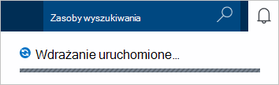
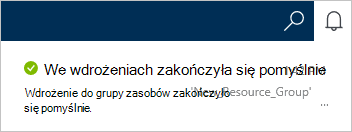
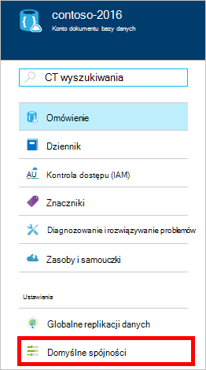
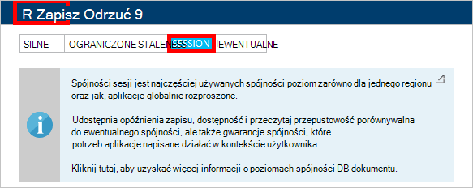

1.  Zaloguj się do [portalu Azure](https://portal.azure.com/).
2.  W Jumpbar kliknij przycisk **Nowy**, kliknij pozycję **dane + miejsca do magazynowania**, a następnie kliknij **DocumentDB (NoSQL)**.

      

3. W karta **nowego konta** określ żądaną konfiguracją konta DocumentDB.

    

    - W polu **identyfikator** wprowadź nazwę identyfikującą konta DocumentDB.  Po uwierzytelnieniu **identyfikator** w polu **identyfikator** zostanie wyświetlony zielony znacznik wyboru. Wartość **Identyfikatora** staje się nazwa hosta w identyfikator URI. **Identyfikator** może zawierać tylko małe litery, cyfry oraz "-" znak, a musi być od 3 do 50 znaków. Należy zauważyć, że nazwa punktu końcowego, wybrane, której wynikiem staje się punkt końcowy konta DocumentDB widnieje tego *documents.azure.com* .

    - W oknie dialogowym **Interfejsu API NoSQL** wybierz **DocumentDB**.  

    - Dla **subskrypcji**wybierz Azure subskrypcję, do której chcesz użyć dla konta DocumentDB. Jeśli Twoje konto zawiera tylko jedną subskrypcję, to konto jest zaznaczona domyślnie.

    - **Grupa zasobów**wybierz lub Utwórz grupę zasobów dla Twojego konta DocumentDB.  Domyślnie jest tworzony nowej grupy zasobów. Aby uzyskać więcej informacji zobacz [Korzystanie portal Azure do zarządzania zasobami Azure](../articles/azure-portal/resource-group-portal.md).

    - Umożliwia określenie geograficzną lokalizację, w której do obsługi konta DocumentDB **lokalizacji** . 

4.  Skonfigurowane nowych opcji konta DocumentDB kliknij przycisk **Utwórz**. Aby sprawdzić stan wdrażania, zaznacz Centrum powiadomienia.  

      

    

5.  Po utworzeniu konta DocumentDB jest gotowa do użycia z ustawień domyślnych. Spójności domyślnego konta DocumentDB jest ustawiona na **sesji**.  Możesz dostosować spójności domyślne, klikając pozycję **Spójności domyślny** w menu zasobów. Aby uzyskać więcej informacji o poziomach spójności oferowanych przez DocumentDB, zobacz [poziomy spójności w DocumentDB](../articles/documentdb/documentdb-consistency-levels.md).

      

      

[How to: Create a DocumentDB account]: #Howto
[Next steps]: #NextSteps
[documentdb-manage]:../articles/documentdb/documentdb-manage.md
