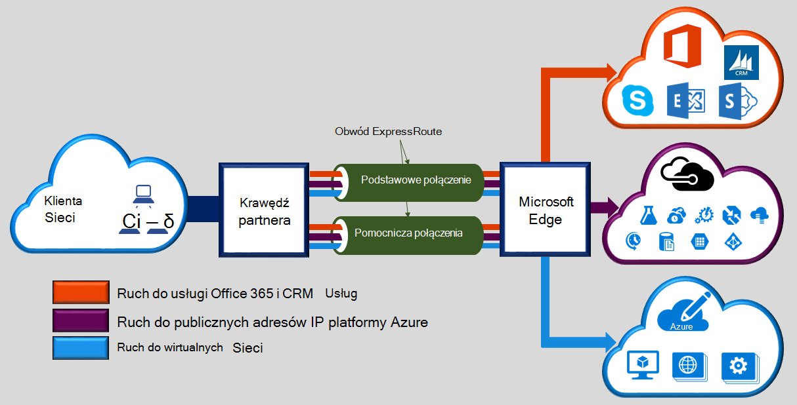

Microsoft Azure ExpressRoute pozwala na rozszerzenie sieci lokalnej w chmurze firmy Microsoft przez połączenie prywatne dedykowane uproszczony przez dostawcę łączności. Przy użyciu ExpressRoute można nawiązać połączenia z usługami w chmurze firmy Microsoft, takich jak Microsoft Azure, Office 365 i CRM Online. Łączność może być dowolna z każdym sieci (IP VPN), sieci Ethernet typu punkt-punkt lub wirtualnego połączenia między przez dostawcę łączności w funkcji współtworzenia lokalizacji. ExpressRoute połączenia nie przechodzą publicznie w Internecie. Dzięki temu ExpressRoute połączenia do oferowania więcej niezawodności, szybkości szybciej, dolnym opóźnienia i lepsze zabezpieczenia niż typowy połączenia przez Internet.  

